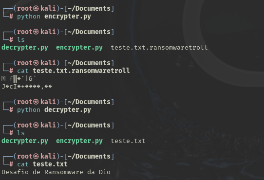

# Ransomware para Sequestro de Dados

### Ferramentas

- Kali Linux
- Python
- Scripts encrypter.py e decrypter.py

## Scripts
- encrypter.py: ´´´   ´´´
- decrypter.py: ´´´   ´´´

### Executando o Ransomware no Kali Linux

- Acesso root: ``` sudo su ```
- Indo para a pasta documentos: ``` cd Documents ```
- Nessa pasta estão armazenados os scripts de criptografia e descriptografia e o arquivo de texto que será utilizado.
- Criptografando os dados do arquivo de texto: ``` python encrypter.py ```
- Lendo o arquivo criptografado: ``` cat teste.txt.ransomwaretroll ```
- Descriptografando os dados do arquivo de texto: ``` python decrypter.py ```
- Lendo o arquivo descriptografado: ``` cat teste.txt ```

### Resultados




